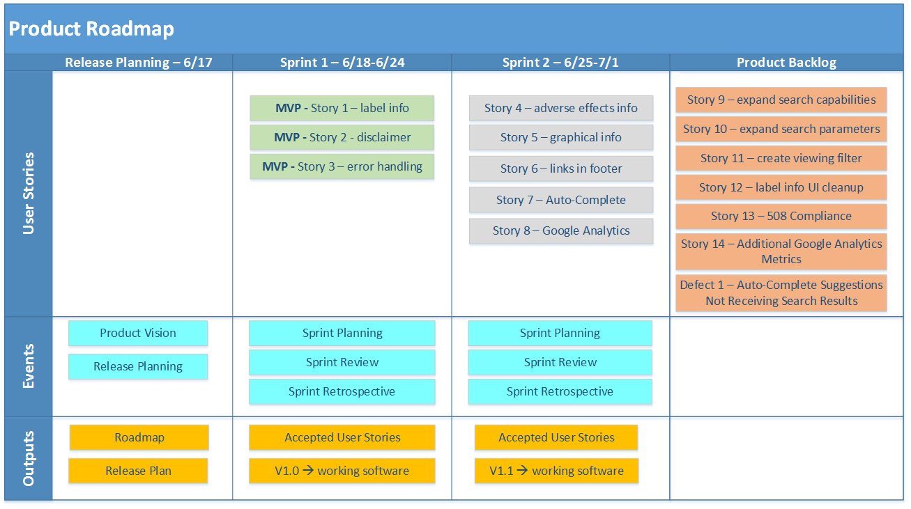

TechFlow, Inc. Response to

Request for Quotation (RFQ)

4QTFHS150004

Agile Delivery Services (ADS I)

Product Roadmap

June 22, 2015

***Proprietary Information Notice***: This document/proposal includes
data that shall not be disclosed outside the Government and shall not be
duplicated, used, or disclosed – in whole or in part – for any purpose
other than to evaluate this and the accompanied proposal. If, however, a
contract is awarded or modified as a result of, or in connection with
the submission of this data, the Government shall have the right to
duplicate, use or disclose the data to the extent provided in the
resulting contract. This restriction does not limit the Government’s
right to use information contained in this data if it is obtained from
another source.

Purpose and Overview
====================

The purpose of this document is to familiarize the reader with the
product roadmap developed by TechFlow for the Food and Drug
Administration (FDA) in support of the Drug and Risk Information (DARI)
public information website. It includes background on the product
vision, a timeline of events, outputs and a listing of user stories
grouped by increment.

Product Roadmap
===============

**Product Vision**

DARI provides the most current information about drugs, both
over-the-counter (OTC) and prescription to allow the consumer to make
timely and informed decisions. The TechFlow application, in support of
the FDA strategic initiative (Approved Risk Evaluation and Mitigations
Strategies), is designed to provide the consumer the ability to view
labeling information without having to acquire the drug.

**Product Increments/Events/Outputs**

The roadmap has been segmented into three product increments, each
increment coinciding with an identifiable deliverable. User stories,
outputs and events are aligned within the roadmap iterations according
to dependencies, priorities and/or resource allocation constraints. It
is through the incremental delivery of the MVP and additional increments
that a robust, flexible search tool will be made available to end users.

The first iteration includes release planning, sprint planning,
development and testing of the MVP, sprint review and sprint
retrospective. The first iteration encapsulates the Minimally Viable
Product (MVP) of basic search functionality. The MVP is prioritized,
planned and to be delivered within the first iteration as it captures
the basic framework of the product.

The second iteration includes sprint planning, development and testing
of the next product increment, sprint review and sprint retrospective;
it encapsulates search enhancements to the MVP. Enhancements to search
functionality were prioritized second with the goal of enhancing the
overall search experience for consumers.

The third increment indicates the remaining product backlog and how the
product could potentially evolve. Backlog items in this increment are a
combination of stretch goals created during initial design and planning
and feedback from sprint reviews and usability testing.

DARI Product Roadmap
