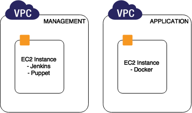
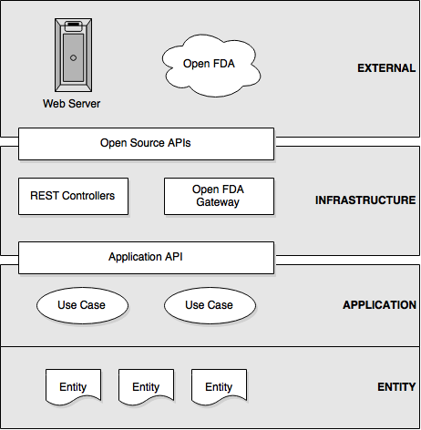
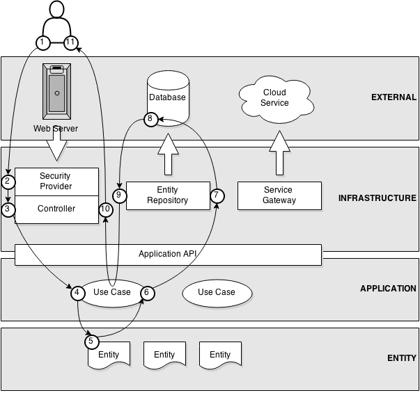
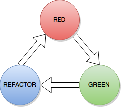
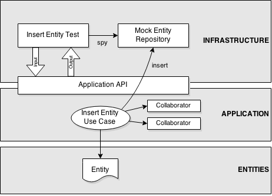
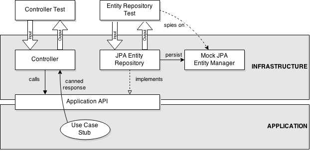
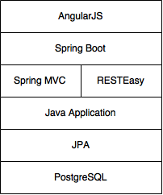
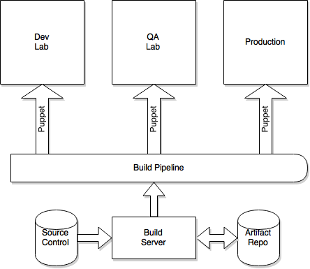

TechFlow, Inc. Response to

Request for Quotation (RFQ)

4QTFHS15004

Agile Delivery Services (ADS I)

Technical Architecture

June 26, 2015

***Proprietary Information Notice***: This document/proposal includes
data that shall not be disclosed outside the Government and shall not be
duplicated, used, or disclosed – in whole or in part – for any purpose
other than to evaluate this and the accompanied proposal. If, however, a
contract is awarded or modified as a result of, or in connection with
the submission of this data, the Government shall have the right to
duplicate, use or disclose the data to the extent provided in the
resulting contract. This restriction does not limit the Government’s
right to use information contained in this data if it is obtained from
another source.

Purpose and Overview
====================

The purpose of this document is to provide the general architectural and
design approach developed by TechFlow for the Food and Drug
Administration (FDA) in support of the Drug and Risk Information (DARI)
public information website. It includes hardware, software and
infrastructure details regarding the application.

Hardware Architecture
=====================

The application was deployed on an IaaS infrastructure using Amazon AWS
as a provider. Two VPCs were used. The application VPC contains the
docker image of the prototype application. The management VPC contains
the continuous integration and deployment system.

Figure 1. Network Architecture

Software Architecture
=====================

Flexibility and testability are key features of an agile software
architecture. It should be easy to add new features, refactor, and test
the software.

The software is divided into four layers: external, infrastructure,
application, and entities. The application API sits between the
infrastructure and application layers and provides a public contract for
the layers to communicate. To achieve flexibility and have low coupling
it is important that the infrastructure and application be isolated and
that neither should know about the internals of the other.

External
--------

The External Layer covers things like the database or cloud services
that are not directly a part of the application.

Infrastructure
--------------

Application frameworks reside in the infrastructure layer. For example,
we use Spring MVC to provide RESTful web services. This layer is kept as
simple as possible. We want it to be possible to easily swap out the
infrastructure layer. If we switch databases it should only be required
to add a new database repository. The application layer should remain
unchanged.

Application
-----------

The application layer is the “conductor”. It implements the use cases
and business rules of the software. To achieve this it manipulates the
domain model in the entity layer.

For example, if a line item were added to an order it would add the line
item to the order entity and then ask the order repository to store the
new line item. The application layer doesn’t concern itself with where
the entity is actually stored. It might be in a database, an XML file,
or in memory. It is only important that the repository fulfils the
contract as specified by the application API.

Entities
--------

The entities are objects which store the data manipulated in the
Application Layer

Request Lifecycle
-----------------

An example of how data passes through the layers of the software.

[put a number on use case 9/10, move loopdyloop to cloud service]

1.  User transmits a request to the web server

2.  Security provider authenticates the user [if applicable]

3.  The request is routed to a controller

4.  The controller invokes a use case

5.  An entity is created

6.  The entity is sent to the entity repository to be saved

7.  The entity repository generates SQL which is transmitted to the
    database

8.  The database performs the SQL operation

9.  The entity repository retrieves the generated key and assigns it to
    the entity

10. The use case populates the response from the entity

11. The data transfer object is converted to HTML and returned to the
    user

Testing
=======

Testing ensures that the software meets the acceptance criteria defined
in the user story. Automated tests reduce the time to fully test the
software by making it possible to fully re-test the software on demand.

Bugs can be introduced into software each time the code it changed.
However, automated testing allows us to run the full suite of tests each
time the code is updated. This is critical to successful agile
development, because in order to evolve the architecture changes must be
made. Automated tests make the code easier to refactor to meet new
requirements. It is also possible to aggressively refactor the software
and ensure it still works.

Test Driven Development
-----------------------

Test driven development is software development technique that improves
code coverage. A test is written, which fails because there is no code
to back it. Then the minimum amount of code is written to make the test
pass. If the test is written after the code it is less obvious if the
test covers all of the code.

The process of test driven development is sometimes referred to as the
"red-green-refactor" loop. The test is written (red), and then code is
written to make the test pass (green). The code written during the green
cycle doesn't need to be well-factored: it only needs to pass the test.
After the test passes the code is refactored. Then the cycle continues.

Test Tools
----------

-   JUnit - A Java based unit test framework.

-   Serenity BDD - a automated web integration test tool. It drives a
    web browser to interact with the website as a user would

Test Coverage
-------------

Jenkins and SonarQube generate reports on the number of unit tests,
their status (pass/fail), and test coverage. , and adherence to source
code formatting rules.

Testability
-----------

This software was designed to be easy to test. The core application
interacts with the infrastructure layer via Java interfaces. The
infrastructure can be swapped out with test objects that emulate the
expected behavior of the system.

### Infrastructure Testing

Ideally the infrastructure layer is simple and thin, so it’s obvious
what it does and doesn’t require testing, but when this isn’t the case
the public API can be stubbed. For example, we can return a “not found”
response from the application layer and verify the controller returns a
404 HTTP response
code.

Technology Stack
================

-   **AngularJS** - A Google-backed open source Front-end MVC framework
    to create a single page application

-   **Spring Boot** - Light-weight, standalone servlet container.

-   **JPA** - Object-relational mapper to map Java objects to relational
    database entries

-   **PostgreSQL** - The world's most advanced open source database

Continuous Integration and Deployment
=====================================

Jenkins performs builds automatically after source code check-ins to
GitHub. A notification is sent to the team chat room. If the unit tests
pass, then a post-build task copies the build to the web server via SSH
and restarts it.

Another Jenkins job updates the project's Maven site which includes
several reports.

Figure 1. Automated Deployment

Documentation
=============

Documentation is automatically generated directly from the source code
wherever possible.

Javadocs are created from the source code. Swagger is used to document
REST services.

[Documentation examples]

[test results]

[rest api]

[java docs]
